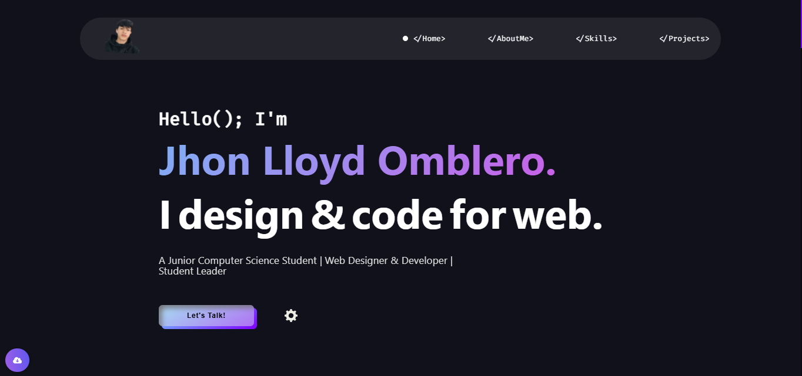

# ePortfolio  

  

Link:

jhonlloydomblero.vercel.app

A personal portfolio website built using modern web technologies to showcase skills, projects, and professional experiences. This project serves as an online resume and portfolio for potential employers and collaborators to explore.  

## Features  

- **Responsive Design**: Optimized for viewing on all devices, including desktops, tablets, and mobile phones.  
- **Showcase Section**: Highlights projects with descriptions, links, and media.  
- **Professional Profile**: Includes a personal bio, tech stacks, skills, and contact information.  
- **Interactive Elements**: Smooth scrolling, animations, and interactive navigation for an engaging user experience.  
- **Customizable**: Easy to update content and add new projects.  

## Technologies Used  

- **Frontend**:  
  - HTML5  
  - CSS3  
  - JavaScript Vanilla 

## Installation  

To set up the project locally, run the following commands in your terminal:  

```bash  
git clone https://github.com/joxyle-jhon/ePortfolio.git  
cd ePortfolio  
npm install  
npm start  
